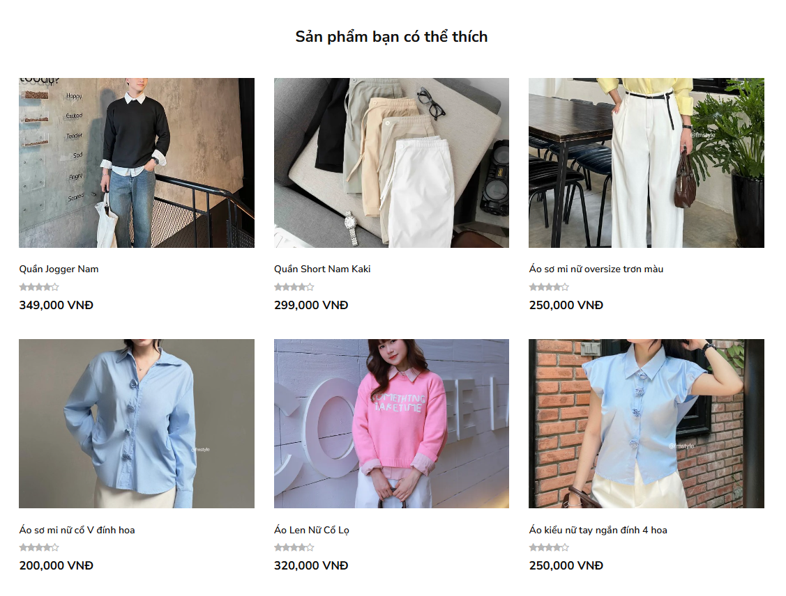
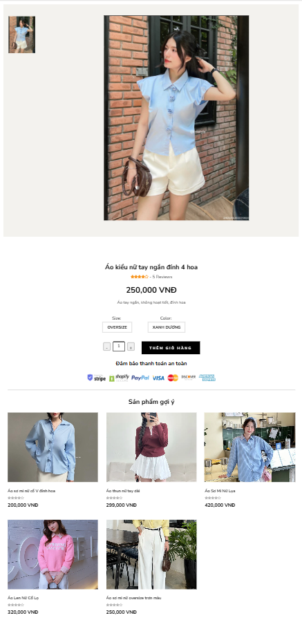
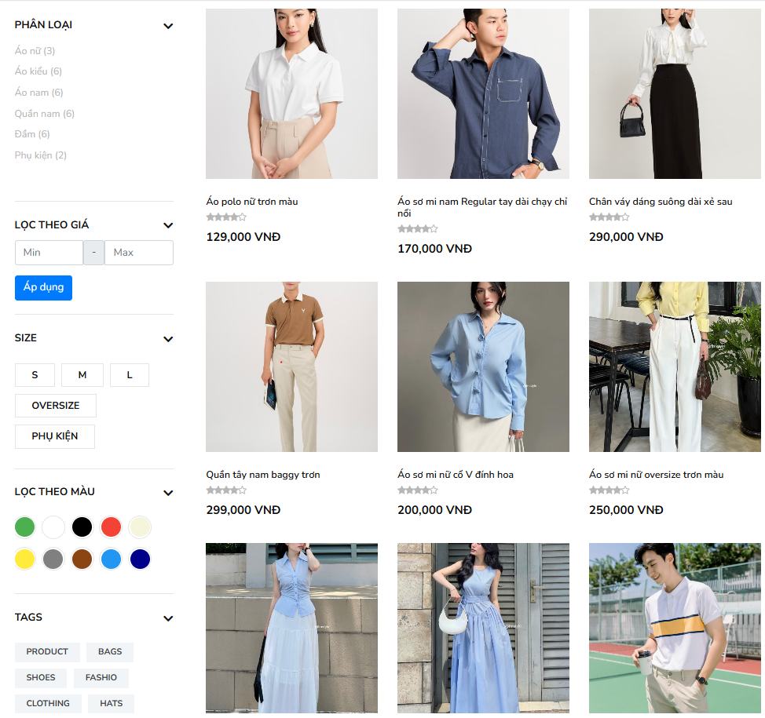
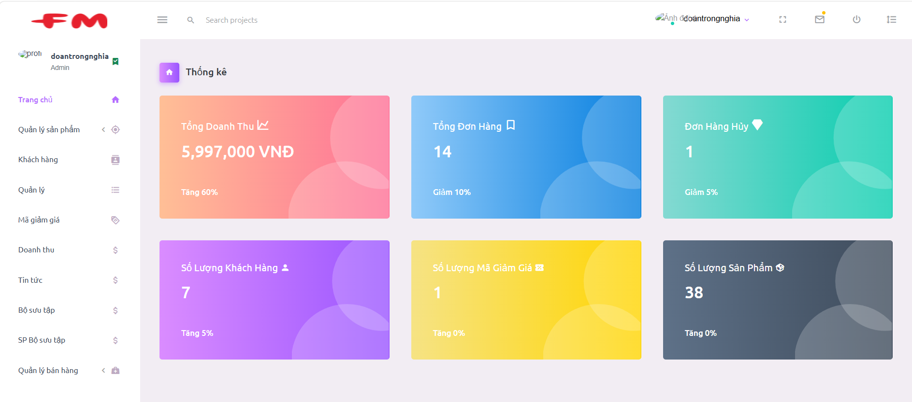
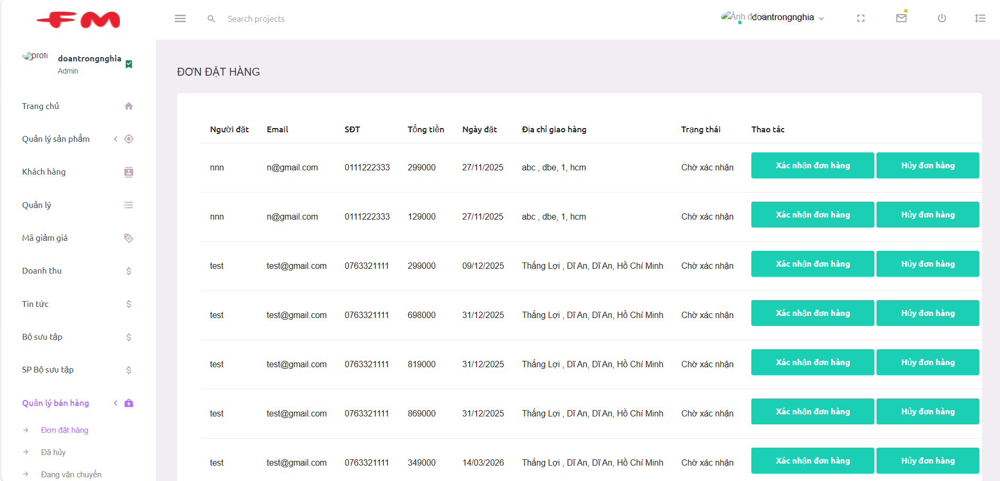

# 👕 AI-based Fashion Product Recommendation System

A full-stack fashion e-commerce web application integrated with an AI-based recommendation system to enhance product discovery and user experience.

---

## 🚀 Key Features

- 🔍 Smart product recommendation based on content similarity  
- 🧠 AI-powered suggestion using TF-IDF and cosine similarity  
- 🛒 Product browsing, filtering, and order management  
- 📊 Admin dashboard for sales and order tracking  

---

## 🤖 Recommendation System

Implemented a **Content-Based Filtering** approach to recommend relevant products based on product features such as name, category, and description.

- Applied **TF-IDF** to convert textual product data into vector representations  
- Used **cosine similarity** to measure similarity between products  
- Generated personalized product suggestions to improve user experience  

---

## 🔁 Similar Products

Displayed similar products based on content similarity using the same recommendation pipeline:

**TF-IDF → Cosine Similarity → Content-Based Filtering**

- Helps users quickly find related items  
- Improves product discovery compared to traditional keyword search  

---

## 🖥️ Product Interface

- Built with **ASP.NET Core MVC + Bootstrap**  
- Responsive UI for product listing and filtering  
- Optimized user experience for browsing and searching  

---

## 📊 Admin Dashboard

- Monitor revenue and order statistics  
- Visualize system performance and business data  

---

## 📦 Order Management

- Manage customer orders and order status  
- Built with **ASP.NET Core MVC + SQL Server**  

---

## ⚙️ Tech Stack

- **Backend:** ASP.NET Core MVC  
- **Frontend:** HTML, CSS, Bootstrap, JavaScript  
- **Database:** SQL Server  

---

## 🧠 Core Technologies

- Content-Based Filtering  
- TF-IDF (Term Frequency – Inverse Document Frequency)  
- Cosine Similarity  

---

## 📌 Highlights

- Built a complete **AI-integrated e-commerce system** from scratch  
- Applied **information retrieval techniques** for real-world recommendation problems  
- Improved product discovery using **content similarity instead of 